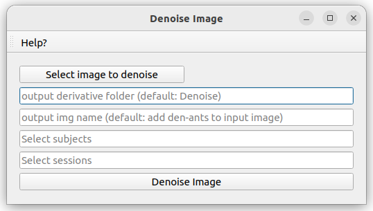

# Denoise

Denoising pipeline to denoise image using the adaptive non-local means algorithm from ANTs ([ANTs registration](http://stnava.github.io/ANTs/))

## Requirements

**ANTs**

Either ANTs installed locally on the user's computer

Or using the docker antx/ants

You can choose which one to run by switching the option in the Denoise.json file

## How to cite

1. Avants B, Tustison N, Song G. Advanced normalization tools (ANTS). Insight J. 2008 Nov 30;1–35.

## Utilization

The first figure below shows the window of this pipeline. This window contains the following information:

* "output derivative folder: name of the output derivative folder to save the denoised image (default: Denoise)

* "output img name": name of the output denoised image name (default: add den-ants to input image name)

* "Select subjects" input: allows the user to script the automatic segmentation for subjects of the dataset by adding a list BIDS ID (without "sub-") separated by a comma. Possible values are: single BIDS ID (e.g. "001,002,006,013"), multiple folowing BIDS ID (e.g. "001-005" is the same as '001,002,003,004,005"), or all subjects ("all").

* "Select sessions" input: allows the user to script the automatic segmentation for sessions of subjects of the dataset by adding a list session ID (without "ses-") separated by a comma. Possible values are: single session ID (e.g. "01,02,06,13"), multiple folowing session ID (e.g. "01-05" is the same as '01,02,03,04,05"), or all sessions ("all").

* "Denoise Image": launch the denoising pipeline

